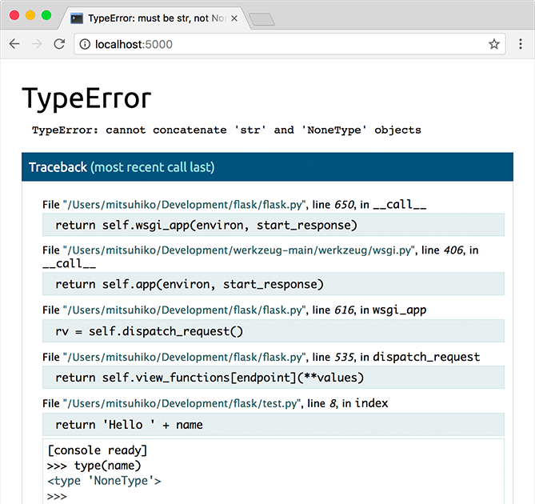

.. _quickstart:

빨리 해 보기
============

얼른 돌려 보고 싶은가? 이 페이지에서 플라스크를 제대로 만나 볼 수 있다.
플라스크가 이미 설치돼 있다고 가정하고 있으니 아직 설치하지 않았다면
:ref:`installation` 절로 가자.


가장 작은 응용
--------------

가장 작은 플라스크 응용은 다음 정도가 될 것이다. ::

    from flask import Flask
    app = Flask(__name__)

    @app.route('/')
    def hello_world():
        return 'Hello, World!'

이 코드에서 뭘 하고 있는지 보자.

1. 먼저 :class:`~flask.Flask` 클래스를 임포트 한다. 이 클래스의 인스턴스가
   우리의 WSGI 응용이 된다.
2. 다음으로 이 클래스의 인스턴스를 생성한다. 첫 번째 인자는 응용의 모듈
   이름이나 패키지 이름이다. (이 예처럼) 단일 모듈이라면 ``__name__`` 을
   쓰는 게 좋은데, 응용으로 실행되느냐 모듈로 임포트 되느냐에 따라 이름이
   (``'__main__'`` 또는 실제 임포트 이름으로) 달라지기 때문이다. 그래야
   플라스크에서 템플릿, 정적 파일 등을 어디에서 찾아야 할지 알 수 있다.
   더 자세한 정보는 :class:`~flask.Flask` 문서를 보라.
3. 그러고서 :meth:`~flask.Flask.route` 데코레이터를 써서 어떤 URL이 우리
   함수를 동작시켜야 할지 플라스크에게 알려 준다.
4. 함수에 주는 이름이 그 특정 함수에 대한 URL을 생성하는 데 쓰이기도 한다.
   사용자의 브라우저에 표시하려는 메시지를 함수에서 반환한다.

:file:`hello.py` 나 비슷한 이름으로 저장하자. 응용 이름을 :file:`flask.py`
라고 하지는 않도록 하자. 플라스크 자체와 충돌하게 된다.

:command:`flask` 명령으로, 또는 파이썬 ``-m`` 인자에 플라스크를 지정해서
응용을 실행할 수 있다. 그 전에 ``FLASK_APP`` 환경 변수를 터미널로 내보여서
돌리려는 응용이 뭔지 알려 주어야 한다. ::

    $ export FLASK_APP=hello.py
    $ flask run
     * Running on http://127.0.0.1:5000/

윈도우에서는 명령행 인터프리터에 따라 환경 변수 문법이 다르다. 명령
프롬프트에서는 다음과 같다. ::

    C:\path\to\app>set FLASK_APP=hello.py

파워셸에서는 다음과 같다. ::

    PS C:\path\to\app> $env:FLASK_APP = "hello.py"

대신 :command:`python -m flask` 방식을 쓸 수도 있다. ::

    $ export FLASK_APP=hello.py
    $ python -m flask run
     * Running on http://127.0.0.1:5000/

그러면 아주 간단한 내장 서버가 뜬다. 테스트 용도로는 충분하지만 실제
운용에서 사용할 만한 건 아니다. 도입 방식에 대해선 :ref:`deployment` 참고.

이제 `http://127.0.0.1:5000/ <http://127.0.0.1:5000/>`_ 로 가 보자. 헬로월드
인사를 볼 수 있을 것이다.

.. _public-server:

.. admonition:: 서버 외부로 드러내기

   서버를 실행해 보면 그 컴퓨터에서만 서버에 접근할 수 있고 네트워크의
   다른 컴퓨터에서는 안 되는 걸 알 수 있다. 이게 기본 동작이다. 디버깅
   모드에서는 응용 사용자가 서버가 도는 컴퓨터에서 임의의 파이썬 코드를
   실행할 수 있기 때문이다.

   디버거를 껐거나 네트워크 상의 사용자들을 믿을 수 있는 경우에는 명령행에
   ``--host=0.0.0.0`` 만 추가하면 모두가 서버를 쓸 수 있게 된다.

       flask run --host=0.0.0.0

   이렇게 하면 운영 체제가 모든 공개 IP들로 연결을 받게 된다.


서버 시작이 안 될 때
--------------------

:command:`python -m flask` 명령이 실패하거나 :command:`flask` 명령이
없다고 나온다면 가능한 원인이 여러 가지 있다. 먼저 오류 메시지를
들여다봐야 한다.

플라스크 구식 버전
``````````````````

플라스크 버전 0.11 전에서는 응용을 시작하는 방식이 다르다. 요컨대
:command:`flask` 명령도 없었고 :command:`python -m flask` 도 없었다.
이 경우 두 가지 선택지가 있다. 더 최근의 플라스크 버전으로
업그레이드 하거나 :ref:`server` 부분에서 서버를 실행하는 다른
방법을 보면 된다.

잘못된 임포트 이름
``````````````````

``FLASK_APP`` 환경 변수는 :command:`flask run` 에서 임포트 할 모듈의
이름이다. 모듈 이름을 잘못 준 경우에는 시작 시에 (또는 디버깅이 켜져
있으면 응용을 열 때) 임포트 오류가 나게 된다. 뭘 임포트 하려고 했고
왜 실패했는지 나올 것이다.

가장 흔한 원인은 오타 때문이거나 ``app`` 객체를 만들어 주지 않아서이다.

.. _debug-mode:

디버그 모드
-----------

(오류와 스택 트레이스를 찍고 싶은 건가? :ref:`application-errors` 를 보라.)

:command:`flask` 스크립트로 로컬 개발 서버를 시작하는 게 간편하긴
하지만 코드에 변경이 있을 때마다 수동으로 재시작을 해 줘야 한다.
그리 간편한 방식이 아닌데 편리하게 만들 방법이 있다. 디버그 지원을
켜면 코드 변경 시 서버가 알아서 재시작을 하고, 또 뭔가 잘못된 경우
유용한 디버거가 제공된다.

모든 개발용 기능들(디버그 모드 포함)을 켜려면 서버 시작 전에 환경
변수 ``FLASK_ENV`` 를 ``development`` 로 설정해서 내보이면 된다. ::

    $ export FLASK_ENV=development
    $ flask run

(윈도우에선 ``export`` 대신 ``set`` 을 써야 한다.)

그러면,

1.  디버거를 활성화하고
2.  자동 재적재를 활성화하고
3.  플라스크 응용에 디버그 모드를 켠다.

환경과 별도로 디버그 모드를 제어할 수도 있다. ``FLASK_DEBUG=1`` 을
내보이면 된다.

더 많은 매개변수들이 있는데 :ref:`server` 부분에서 설명한다.

.. admonition:: 주의

   포크를 하는 환경에서는 대화형 디버거가 동작하지 않기는 하지만 (그래서
   실제 운용 서버에서는 사용이 거의 불가능하다.) 그래도 임의 코드의 실행이
   가능하기는 하다. 이는 중대한 보안적 위험이며 따라서 **실제 운용
   머신에서는 절대 사용해선 안 된다**.

디버거 동작 스크린샷:



디버거 사용에 대한 내용은 `Werkzeug 문서`_ 에서 볼 수 있다.

.. _Werkzeug 문서: http://werkzeug.pocoo.org/docs/debug/#using-the-debugger

다른 디버거를 생각하고 있다면? :ref:`working-with-debuggers` 를 보라.


루트 만들기
-----------

요즘 웹 응용들은 사용자를 위해 의미 있는 URL을 사용한다. 페이지에
의미 있는 URL을 사용해서 사용자가 그걸 기억할 수 있다면 페이지를
마음에 들어 한 사용자가 다시 방문할 가능성이 더 높을 것이다.

:meth:`~flask.Flask.route` 데코레이터를 사용해 함수와 URL을
연결할 수 있다. ::

    @app.route('/')
    def index():
        return 'Index Page'

    @app.route('/hello')
    def hello():
        return 'Hello, World'

이게 끝이 아니다! URL 일부를 동적으로 만들거나 한 함수에 여러 규칙을
붙일 수도 있다.

변수 규칙
`````````

URL에 ``<변수_이름>`` 표시를 해서 변수 부분을 추가할 수 있다.
그러면 함수에서 그 ``<변수_이름>`` 을 키워드 인자로 받는다.
선택적으로 ``<변환자:변수_이름>`` 처럼 변환자를 써서 인자 타입을
지정할 수 있다. ::

    @app.route('/user/<username>')
    def show_user_profile(username):
        # 이 사용자의 사용자 프로필 표시
        return 'User %s' % username

    @app.route('/post/<int:post_id>')
    def show_post(post_id):
        # 주어진 id의 글 표시. id는 정수
        return 'Post %d' % post_id

    @app.route('/path/<path:subpath>')
    def show_subpath(subpath):
        # /path/ 뒤의 하위 경로 표시
        return 'Subpath %s' % subpath

변환자 종류:

========== ==========================================
``string`` (기본) 슬래시 없는 텍스트 받음
``int``    양의 정수 받음
``float``  양의 실수 받음
``path``   ``string`` 과 같되 슬래시도 받아들임
``uuid``   UUID 문자열 받음
========== ==========================================

고유 URL / 재지향 동작
``````````````````````

다음 두 규칙에서는 마지막 슬래시 사용 여부가 다르다. ::

    @app.route('/projects/')
    def projects():
        return 'The project page'

    @app.route('/about')
    def about():
        return 'The about page'

``projects`` 종점의 정식 URL에는 끝에 슬래시가 있다.
파일 시스템의 폴더와 비슷하다. 그 URL에 마지막 슬래시
없이 접근하면 플라스크가 마지막 슬래시 있는 정식 URL로
재지향 한다.

``about`` 종점의 정식 URL에는 끝에 슬래시가 없다.
파일 경로명과 비슷하다. 끝에 슬래시가 있는 URL에 접근하면
404 "Not Found" 오류가 발생한다. 이렇게 하면 이 자원에 대한
URL을 유일하게 유지할 수 있고, 그러면 검색 엔진이 같은
페이지를 두 번 인덱싱 하는 걸 피할 수 있게 된다.


.. _url-building:

URL 만들기
``````````

특정 함수로 가는 URL을 만들려면 :func:`~flask.url_for` 함수를
쓰면 된다. 함수 인자를 첫 번째 인자로 받고 URL 규칙의 변수
부분에 각기 대응하는 임의 개수의 키워드 인자를 받는다.
대응하는 변수 부분이 없으면 URL 뒤에 질의 매개변수로 덧붙는다.

왜 템플릿에 하드 코딩 하는 대신 URL 역함수 :func:`~flask.url_for`
를 써서 URL를 만들어야 할까?

1. 역함수가 URL을 하드 코딩 하는 것보다 서술적인 경우가 많다.
2. 하드 코딩 된 URL들을 기억했다가 직접 바꿀 필요 없이 한 번에
   URL을 바꿀 수 있다.
3. URL 만들기 방식에서는 특수 문자 이스케이핑과 유니코드
   데이터를 투명하게 처리해 준다.
4. 생성되는 경로가 항상 절대 경로여서 브라우저에서 상대 경로의
   예기치 못한 동작을 피한다.
5. 응용을 URL 루트 밖에, 가령 ``/`` 대신 ``/myapplication`` 에
   두는 경우에 :func:`~flask.url_for` 가 그걸 제대로 처리해
   준다.

예를 들어 다음과 같이 :meth:`~flask.Flask.test_request_context`
메소드를 사용해 :func:`~flask.url_for` 를 써 볼 수 있다.
:meth:`~flask.Flask.test_request_context` 는 파이썬 셸을 쓰는
동안에도 플라스크가 요청을 처리할 때처럼 동작하게 한다.
:ref:`context-locals` 참고. ::

    from flask import Flask, url_for

    app = Flask(__name__)

    @app.route('/')
    def index():
        return 'index'

    @app.route('/login')
    def login():
        return 'login'

    @app.route('/user/<username>')
    def profile(username):
        return '{}\'s profile'.format(username)

    with app.test_request_context():
        print(url_for('index'))
        print(url_for('login'))
        print(url_for('login', next='/'))
        print(url_for('profile', username='John Doe'))

    /
    /login
    /login?next=/
    /user/John%20Doe

HTTP 메소드
```````````

웹 응용에서는 URL 접근에 다양한 HTTP 메소드를 쓴다. 플라스크로 작업을
하자면 HTTP 메소드들에 익숙해질 필요가 있다. 기본적으로 route는
``GET`` 요청에만 답을 하는데 :meth:`~flask.Flask.route` 데코레이터의
``methods`` 인자를 써서 다른 HTTP 메소드들을 처리할 수 있다. ::

    from flask import request

    @app.route('/login', methods=['GET', 'POST'])
    def login():
        if request.method == 'POST':
            return do_the_login()
        else:
            return show_the_login_form()

``GET`` 이 있으면 플라스크에서 자동으로 ``HEAD`` 메소드 지원을 추가해서
`HTTP RFC`_ 에 따라 ``HEAD`` 요청을 처리한다. 마찬가지로 ``OPTIONS`` 를
자동으로 처리해 준다.

.. _HTTP RFC: https://www.ietf.org/rfc/rfc2068.txt

정적 파일
---------

동적 웹 응용에서도 정적 파일이 필요하다. 보통 CSS와 자바스크립트
파일들이 해당된다. 이상적으로는 웹 서버가 그 파일들을 다루도록
구성하게 되겠지만 개발 중에는 플라스크가 그 역할을 해 줄 수도 있다.
패키지 안이나 모듈 바로 옆에 :file:`static` 이라는 폴더를 만들기만
하면 응용에서 ``/static`` 으로 쓸 수 있게 된다.

정적 파일에 대한 URL을 만들려면 특수 종점명 ``'static'`` 을 쓰면
된다. ::

    url_for('static', filename='style.css')

파일 시스템 상에 파일이 :file:`static/style.css` 로 저장돼 있으면
된다.

템플릿 렌더링
-------------

파이썬에서 HTML을 만들어 내는 건 재밌는 일이 아니다. 사실 꽤나
귀찮은 일인데, 응용을 안전하게 유지하기 위해 HTML 이스케이핑을
직접 해 줘야 하기 때문이다. 그래서 플라스크는 기본적으로
`Jinja2 <http://jinja.pocoo.org/>`_ 템플릿 엔진을 이용하게 돼 있다.

템플릿을 렌더링 하려면 :func:`~flask.render_template` 메소드를
쓰면 된다. 템플릿 이름, 그리고 템플릿 엔진에 전달할 변수들을
키워드 인자로 주기만 하면 된다. 다음은 간단한 템플릿 렌더링
예시이다. ::

    from flask import render_template

    @app.route('/hello/')
    @app.route('/hello/<name>')
    def hello(name=None):
        return render_template('hello.html', name=name)

:file:`templates` 폴더에서 플라스크가 템플릿을 찾게 된다.
작성하는 응용이 모듈이라면 모듈 바로 옆에 그 폴더가 있게 되고
패키지라면 패키지 안에 있게 된다.

**경우 1**: 모듈::

    /application.py
    /templates
        /hello.html

**경우 2**: 패키지::

    /application
        /__init__.py
        /templates
            /hello.html

템플릿에서 Jinja2 템플릿 기능 전부를 이용할 수 있다. 자세한 내용은
공식 `Jinja2 문서 <http://jinja.pocoo.org/docs/templates>`_ 를 보라.

다음은 예시 템플릿이다.:

.. sourcecode:: html+jinja

    <!doctype html>
    <title>Hello from Flask</title>
    
      <h1>Hello {{ name }}!</h1>
    
      <h1>Hello, World!</h1>
    

템플릿 안에서 :class:`~flask.request`, :class:`~flask.session`,
:class:`~flask.g` [#]_ 객체에 접근할 수 있으며
:func:`~flask.get_flashed_messages` 함수에도 접근 가능하다.

템플릿은 상속을 쓸 때 특히 유용하다. 어떻게 하는 건지 궁금하다면
:ref:`template-inheritance` 패턴 문서로 가면 된다. 기본적으로는
템플릿 상속을 통해 (헤더, 메뉴, 푸터 같은) 특정 요소들을 각
페이지마다 넣는 게 가능하다.

자동 이스케이핑이 켜져 있으므로 ``name`` 에 HTML이 들어 있으면
자동으로 이스케이프 된다. 변수를 신뢰할 수 있고 그게 안전한
HTML이란 걸 알고 있다면 (예를 들어 위키 마크업을 HTML로 변환하는
모듈에서 온 경우) :class:`~jinja2.Markup` 클래스를 쓰거나
템플릿에 ``|safe`` 필터를 써서 안전하다고 표시할 수 있다.
더 많은 예는 Jinja 2 문서를 보라.

다음은 :class:`~jinja2.Markup` 클래스 동작 방식을 보여 주는
간단한 예이다. ::

    >>> from flask import Markup
    >>> Markup('<strong>Hello %s!</strong>') % '<blink>hacker</blink>'
    Markup(u'<strong>Hello &lt;blink&gt;hacker&lt;/blink&gt;!</strong>')
    >>> Markup.escape('<blink>hacker</blink>')
    Markup(u'&lt;blink&gt;hacker&lt;/blink&gt;')
    >>> Markup('<em>Marked up</em> &raquo; HTML').striptags()
    u'Marked up \xbb HTML'

.. versionchanged:: 0.5

   이제는 자동 이스케이핑이 모든 템플릿에 켜지지 않는다. 템플릿
   확장자가 ``.html``, ``.htm``, ``.xml``, ``.xhtml`` 이면 자동
   이스케이핑이 켜진다. 문자열에서 적재한 템플릿에선 자동
   이스케이핑이 꺼져 있다.

.. [#] :class:`~flask.g` 객체가 뭔지 궁금한가? 필요한 대로
   정보를 저장할 수 있는 무언가이다. 자세한 건 객체
   (:class:`~flask.g`) 문서와 :ref:`sqlite3` 절을 보라.


요청 데이터에 접근하기
----------------------

웹 응용에 꼭 필요한 건 클라이언트가 서버로 보낸 데이터에 대응하는
것이다. 플라스크에서는 그 정보가 전역 :class:`~flask.request`
객체로 제공된다. 파이썬에 경험이 좀 있다면 어떻게 그 객체가
전역인데도 플라스크가 스레드에 안전할 수 있는지 궁금할 수도
있겠다. 답은 문맥 로컬에 있다.


.. _context-locals:

문맥 로컬
`````````

.. admonition:: 내부용 정보

   문맥 로컬이 어떻게 동작하고 어떻게 테스트 해 볼 수 있는지
   이해하고 싶다면 이 절을 읽고, 아니라면 그냥 건너 뛰면 된다.

플라스크에서 어떤 객체들은 전역 객체이되 일반적인 전역은 아니다.
그 객체들은 사실 특정 문맥에 로컬인 객체들로 가는 프록시이다.
뭔 소린가 싶을 수도 있겠지만 사실 그리 이해하기 어려운 게 아니다.

문맥이란 건 요청을 처리 중인 스레드라고 생각하면 된다. 요청이
들어오면 웹 서버에서는 새 스레드를 (또는 스레드 아닌 다른 어떤
동시성 시스템을 다룰 수 있는 기반 객체를) 만들기로 한다.
그러면 플라스크에서는 내부 요청 처리를 시작할 때 현재 스레드가
활성 문맥임을 알아내서 현 응용과 WSGI 환경을 그 문맥(스레드)과
결속시킨다. 그걸 똑똑한 방식으로 해 주기 때문에 한 응용에서 다른
응용을 문제 없이 호출할 수도 있다.

그래서 그게 어쨌다는 걸까? 기본적으로 유닛 테스트 비슷한 뭔가를
하고 있는 게 아닌 한 그게 그런 거란 걸 아예 잊고 지낼 수 있다.
하지만 맞다면 request 객체에 의존하는 코드가 갑자기 동작하지 않는
걸 보게 될 것이다. request 객체가 없기 때문이다. 해법은 직접
request 객체를 만들어서 문맥에 결속시키는 것이다. 유닛 테스팅에서
가장 쉬운 해법은 :meth:`~flask.Flask.test_request_context` 문맥
관리자를 쓰는 것이다. ``with`` 문과 함께 쓰면 테스트 문맥을
결속시켜 주므로 request 객체를 이용할 수 있게 된다. 다음이 예이다. ::

    from flask import request

    with app.test_request_context('/hello', method='POST'):
        # 이제 with 블록이 끝날 때까지 request로 이것저것
        # 할 수 있다.
        assert request.path == '/hello'
        assert request.method == 'POST'

또 다른 방법은 :meth:`~flask.Flask.request_context` 메소드에
WSGI 환경 전체를 주는 것이다. ::

    from flask import request

    with app.request_context(environ):
        assert request.method == 'POST'

request 객체
````````````

API 절에서 request 객체를 설명하고 있으므로 여기에선 자세히 다루지 않겠다.
(:class:`~flask.Request` 참고.) 여기선 흔히 쓰는 방식을 개략적으로 좀
살펴본다. 일단은 ``flask`` 모듈에서 임포트 해야 한다. ::

    from flask import request

:attr:`~flask.Request.method` 속성을 이용해 현재 요청 메소드를 얻을 수
있다. 폼 데이터(``POST`` 나 ``PUT`` 요청으로 전송된 데이터)에 접근하려면
:attr:`~flask.Request.form` 속성을 쓰면 된다. 다음은 그 두 속성을 쓰는
예시이다. ::

    @app.route('/login', methods=['POST', 'GET'])
    def login():
        error = None
        if request.method == 'POST':
            if valid_login(request.form['username'],
                           request.form['password']):
                return log_the_user_in(request.form['username'])
            else:
                error = 'Invalid username/password'
        # 요청 메소드가 GET이었거나 인증 정보가 틀린
        # 경우에 아래 코드가 실행됨
        return render_template('login.html', error=error)

``form`` 속성에 키가 존재하지 않으면 어떻게 될까? 그 경우 :exc:`KeyError`
예외가 일어난다. 표준 :exc:`KeyError` 처럼 잡을 수도 있고 안 잡으면
404 Bad Request 오류 페이지가 대신 표시된다. 따라서 많은 경우에선 그
문제를 직접 처리해 주지 않아도 된다.

URL로 전달되는 매개변수(``?key=value``)에 접근하려면
:attr:`~flask.Request.args` 속성을 쓰면 된다. ::

    searchword = request.args.get('key', '')

URL 매개변수에 접근할 때 `get` 을 쓰거나 :exc:`KeyError` 를 잡기를
권한다. 사용자가 URL을 바꿀 수도 있을 텐데 그 경우 사용자에게 400
Bad Request 페이지를 보여 주는 건 친절하지가 않기 때문이다.

request 객체의 메소드와 속성 목록 전체는 :class:`~flask.Request`
문서를 보면 된다.


파일 업로드
```````````

업로드 된 파일을 플라스크로 쉽게 다룰 수 있다. 딱 하나, HTML 폼에
``enctype="multipart/form-data"`` 속성 설정하는 것만 잊지 않으면
된다. 설정하지 않으면 브라우저가 파일을 아예 전송하지 않을 것이다.

업로드 된 파일은 메모리 안이나 파일 시스템 상의 임시 위치에 저장된다.
request 객체에서 :attr:`~flask.request.files` 속성을 살펴보면
그 파일들에 접근할 수 있다. 업로드 된 파일 각각이 그 딕셔너리 안에
저장돼 있다. 표준 파이썬 :class:`file` 객체처럼 동작하고 더불어
:meth:`~werkzueg.datastructures.FileStorage.save` 메소드가 있어서
그 파일을 서버 파일 시스템 상에 저장할 수도 있다. 다음은 사용
방식을 보여 주는 간단한 예시이다. ::

    from flask import request

    @app.route('/upload', methods=['GET', 'POST'])
    def upload_file():
        if request.method == 'POST':
            f = request.files['the_file']
            f.save('/var/www/uploads/uploaded_file.txt')
        ...

파일이 응용으로 업로드 되기 전에 클라이언트 상에서 어떤 이름이었는지
알고 싶다면 :attr:`~werkzeug.datastructures.FileStorage.filename`
속성을 보면 된다. 하지만 그 값은 조작될 수 있다는 점을 부디 유념해야
하고 절대 그 값을 신뢰해서는 안 된다. 파일을 클라이언트에서의
파일명으로 서버에 저장하고 싶다면 Werkzeug에서 제공하는
:func:`~werkzeug.utils.secure_filename` 함수를 거치면 된다. ::

    from flask import request
    from werkzeug.utils import secure_filename

    @app.route('/upload', methods=['GET', 'POST'])
    def upload_file():
        if request.method == 'POST':
            f = request.files['the_file']
            f.save('/var/www/uploads/' + secure_filename(f.filename))
        ...

더 괜찮은 예시들은 :ref:`uploading-files` 패턴을 확인해 보라.

쿠키
````

쿠키에 접근하려면 :attr:`~flask.Request.cookies` 속성을 이용하면 된다.
그리고 쿠키를 설정하려면 response 객체의 :attr:`~flask.Response.set_cookie`
메소드를 쓰면 된다. request 객체의 :attr:`~flask.Request.cookies`
속성은 클라이언트가 보낸 모든 쿠키들이 있는 딕셔너리이다.
세션을 이용하고 싶다면 쿠키를 직접 쓰지 말고 플라스크의
:ref:`sessions` 를 이용하라. 쿠키 위에 보안성이 좀 추가돼 있다.

쿠키 읽기::

    from flask import request

    @app.route('/')
    def index():
        username = request.cookies.get('username')
        # 쿠키가 없을 때 KeyError를 받지 않기 위해
        # cookies[key] 대신 cookies.get(key) 사용

쿠키 저장하기::

    from flask import make_response

    @app.route('/')
    def index():
        resp = make_response(render_template(...))
        resp.set_cookie('username', 'the username')
        return resp

보다시피 response 객체에 쿠키를 설정한다. 보통은 view 함수에서
문자열만 반환하고 말기 때문에 플라스크에서 그걸 response 객체로
변환해 준다. :meth:`~flask.make_response` 함수로 그 과정을
명시적으로 거친 다음 객체를 변경하면 된다.

때로는 response 객체가 아직 존재하지 않는 지점에서 쿠키를
설정하고 싶을 수도 있을 것이다. :ref:`deferred-callbacks`
패턴을 활용하면 가능하다.

관련해서 :ref:`about-responses` 도 참고.

재지향과 오류
-------------

사용자를 다른 종점으로 재지향 하려면 :func:`~flask.redirect`
함수를 쓰면 된다. 오류 코드를 주며 요청을 일찍 중단하고 싶으면
:func:`~flask.abort` 함수를 쓰면 된다. ::

    from flask import abort, redirect, url_for

    @app.route('/')
    def index():
        return redirect(url_for('login'))

    @app.route('/login')
    def login():
        abort(401)
        this_is_never_executed()

사용자를 인덱스에서 접근 불가능한 (401은 접근 불가를 뜻함)
페이지로 재지향 하는 것이니 좀 무의미한 예시이긴 하지만
동작 방식을 잘 보여 준다.

기본적으로 각 오류 코드마다 흑백 오류 페이지가 표시된다.
그 오류 페이지를 바꾸고 싶다면 :meth:`~flask.Flask.errorhandler`
데코레이터를 쓸 수 있다. ::

    from flask import render_template

    @app.errorhandler(404)
    def page_not_found(error):
        return render_template('page_not_found.html'), 404

:func:`~flask.render_template` 호출 뒤의 ``404`` 에 유의하자.
페이지의 상태 코드가 찾지 못했다는 뜻인 404여야 한다고 플라스크에게
알려 주는 것이다. 지정하지 않으면 다 잘 됐다는 의미인 200을 상정한다.

더 자세한 건 :ref:`error-handlers` 참고.

.. _about-responses:

응답에 대해
-----------

view 함수의 반환 값은 자동으로 response 객체로 변환된다. 반환 값이
문자열이면 그 문자열을 응답 바디로 하고 상태 코드 ``200 OK`` 에
mimetype은 :mimetype:`text/html` 인 response 객체로 변환된다.
반환 값을 response 객체로 변환할 때 플라스크에서 적용하는 로직은
다음과 같다.

1.  올바른 타입의 response 객체가 view에서 반환됐으면 그대로
    반환한다.
2.  문자열이면 그 데이터와 기본 매개변수를도 response 객체를
    만든다.
3.  튜플이 반한되는 경우 튜플 안의 항목들이 추가 정보를 줄 수
    있다. 그 튜플은 ``(response, status, headers)``,
    ``(response, status)``, ``(response, headers)`` 중 한
    형태여야 한다. ``status`` 값은 상태 코드를 바꾸게 되며
    ``headers`` 는 추가 헤더 값들의 리스트나 딕셔너리일 수 있다.
4.  어느 경우도 아니면 플라스크에서는 반환 값이 유효한 WSGI
    응용이라고 가정하고 그걸 response 객체로 변환하게 된다.

view 내에서 결과 response 객체를 건드리고 싶다면
:func:`~flask.make_response` 함수를 쓰면 된다.

다음과 같은 view 함수가 있다고 하자. ::

    @app.errorhandler(404)
    def not_found(error):
        return render_template('error.html'), 404

반환 식을 :func:`~flask.make_response` 로 감싸 주기만 하면
된다. 그리고 response 객체를 얻어서 변경한 다음 반환한다. ::

    @app.errorhandler(404)
    def not_found(error):
        resp = make_response(render_template('error.html'), 404)
        resp.headers['X-Something'] = 'A value'
        return resp

.. _sessions:

세션
----

request 오브젝트와 더불어 :class:`~flask.session` 이라는 두 번째
객체가 있어서 사용자별 정보를 요청들에 걸쳐서 저장할 수 있다.
세션은 쿠키 상에서 구현돼 있으며 쿠키에 암호학적 서명을 한다.
즉 사용자가 쿠키의 내용물을 볼 수는 있지만 서명에 쓰인 비밀키를
알고 있지 않는 한 변경할 수는 없다.

세션을 쓰기 위해선 비밀키를 설정해야 한다. 세션은 다음과 같이
사용한다. ::

    from flask import Flask, session, redirect, url_for, escape, request

    app = Flask(__name__)

    # 어떤 난수 바이트들로 비밀키를 설정. 진짜 비밀로 유지할 것!
    app.secret_key = b'_5#y2L"F4Q8z\n\xec]/'

    @app.route('/')
    def index():
        if 'username' in session:
            return 'Logged in as %s' % escape(session['username'])
        return 'You are not logged in'

    @app.route('/login', methods=['GET', 'POST'])
    def login():
        if request.method == 'POST':
            session['username'] = request.form['username']
            return redirect(url_for('index'))
        return '''
            <form method="post">
                <p><input type=text name=username>
                <p><input type=submit value=Login>
            </form>
        '''

    @app.route('/logout')
    def logout():
        # 세션에 username이 있으면 제거
        session.pop('username', None)
        return redirect(url_for('index'))

여기 등장하는 :func:`~flask.escape` 는 (이 예처럼) 템플릿을 쓰지
않는 경우에 이스케이핑을 해 준다.

.. admonition:: 좋은 비밀키 만드는 방법

    비밀키는 가급적 난수적이어야 한다. 운영 체제마다 암호학적 난수
    생성기를 바탕으로 깔끔하게 난수 데이터를 생성하는 방식이 있다.
    다음 명령으로 :attr:`Flask.secret_key`에 (또는 :data:`SECRET_KEY` 에)
    쓸 값을 얼른 만들 수 있다. ::

        $ python -c 'import os; print(os.urandom(16))'
        b'_5#y2L"F4Q8z\n\xec]/'

쿠키 기반 세션 참고 사항: session 객체에 넣어 준 값들을 플라스크가
쿠키로 직렬화 해 준다. 혹시 어떤 값이 요청을 거치면서 유지되지 않는
걸 발견했는데 쿠키가 제대로 켜져 있고 확실한 오류 메시지를 받은 게
없다면 페이지 응답의 쿠키 크기와 웹 브라우저에서 보낸 크기를
비교해 보라.

기본 방식인 클라이언트 기반 세션 말고 서버 측에서 세션을 처리하고
싶다면 그걸 지원하는 여러 플라스크 확장을 이용할 수 있다.

메시지 기입
-----------

응용과 사용자 인터페이스가 좋다는 건 결국 피드백에 대한 것이다.
충분한 피드백을 받지 못하면 사용자는 결국 그 응용을 싫어하게
될 것이다. 플라스크에는 정말 간단히 사용자에게 피드백을 줄 수
있는 기입 시스템(flashing system)이라는 게 있다. 기본적으로 기입
시스템이 해 주는 건 어떤 요청 마지막에서 메시지를 기록하고 그걸
다음 요청에서(만) 접근할 수 있게 하는 것이다. 일반적으로 레이아웃
템플릿과 결합해서 메시지를 보이게 된다.

메시지를 기입하려면 :func:`~flask.flash` 메소드를 쓰면 된다.
메시지를 얻어 오려면 :func:`~flask.get_flashed_messages` 를 쓰면
되고 템플릿에서도 사용 가능하다. :ref:`message-flashing-pattern`
절에서 제대로 된 사용례를 볼 수 있다.

로그
----

.. versionadded:: 0.3

정확해야 하는데 실제로는 그렇지 않은 데이터를 다뤄야 하는 상황이
때때로 있을 수도 있다. 예를 들어 어떤 클라이언트 측 코드에서 서버로
HTTP 요청을 보내게 했는데 명백히 잘못된 형식일 수가 있다. 사용자가
데이터를 조작해서일 수도 있겠고 클라이언트 코드가 오동작해서일 수도
있을 것이다. 그런 경우에 대부분은 ``400 Bad Request`` 로 응답하면
그만이지만 때로는 그렇게 해결할 수가 없고 코드가 계속 진행을 해야
한다.

그럴 때에도 뭔가 수상한 일이 일어났다는 걸 기록으로 남기고 싶을 수
있다. 이때 로거가 있으면 딱이다. 플라스크 0.3부터 로거가 미리 구성돼
있어서 바로 이용할 수 있다.

다음은 몇 가지 예시 로그 호출이다. ::

    app.logger.debug('A value for debugging')
    app.logger.warning('A warning occurred (%d apples)', 42)
    app.logger.error('An error occurred')

``app`` 에 붙어 있는 :attr:`~flask.Flask.logger` 는 표준 logging
패키지의 :class:`~logging.Logger` 이므로 자세한 내용은
`logging 문서 <http://docs.python.org/library/logging.html>`_ 를
보면 된다.

:ref:`application-errors` 절로 이어진다.

WSGI 미들웨어 후킹
------------------

응용에 WSGI 미들웨어를 추가하고 싶다면 그 내부 WSGI 응용을 감싸
주면 된다. 예를 들어 lighttpd 버그를 우회하기 위해 Werkzeug
패키지의 미들웨어 하나를 가져와 쓰고 싶다면 다음처럼 하면 된다. ::

    from werkzeug.contrib.fixers import LighttpdCGIRootFix
    app.wsgi_app = LighttpdCGIRootFix(app.wsgi_app)

플라스크 확장 사용하기
----------------------

확장이란 흔히 하는 작업들을 도와 주는 패키지들이다. 예를 들어
Flask-SQLAlchemy 확장은 SQLAlchemy 지원을 제공해서 플라스크에서
간편하고 쉽게 쓸 수 있게 해 준다.

플라스크 확장에 대한 자세한 내용은 :ref:`extensions` 절을 보라.

웹 서버로 배포하기
------------------

새 플라스크 앱을 배포할 준비가 됐는가? :ref:`deployment` 절로 가자.
